<p align="center">
  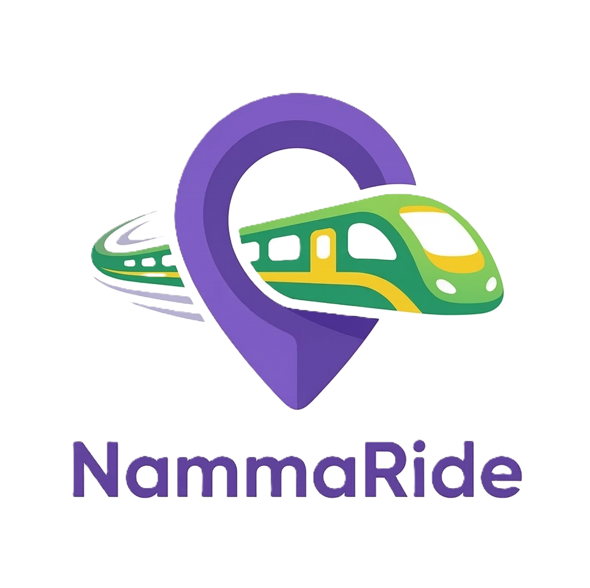
</p>

<h1 align="center">NammaRide</h1>

<p align="center">
  <strong>Your Smart Companion for Bengaluru's Namma Metro</strong>
</p>

<p align="center">
  <a href="https://www.nammaride.site/"></a>
  <a href="https://github.com/Tusharjain-19/NammaRide"></a>
</p>

<p align="center">
  
  
  
  
</p>

---

## 📖 About

**NammaRide** is a fast, offline-capable web application that helps commuters navigate Bengaluru's Namma Metro system with confidence. Unlike generic navigation apps that lose GPS accuracy underground, NammaRide uses **time-based prediction heuristics** and a curated metro-specific dataset to deliver reliable journey information — even in tunnels.

---

## 🖼️ App Gallery

<p align="center">
  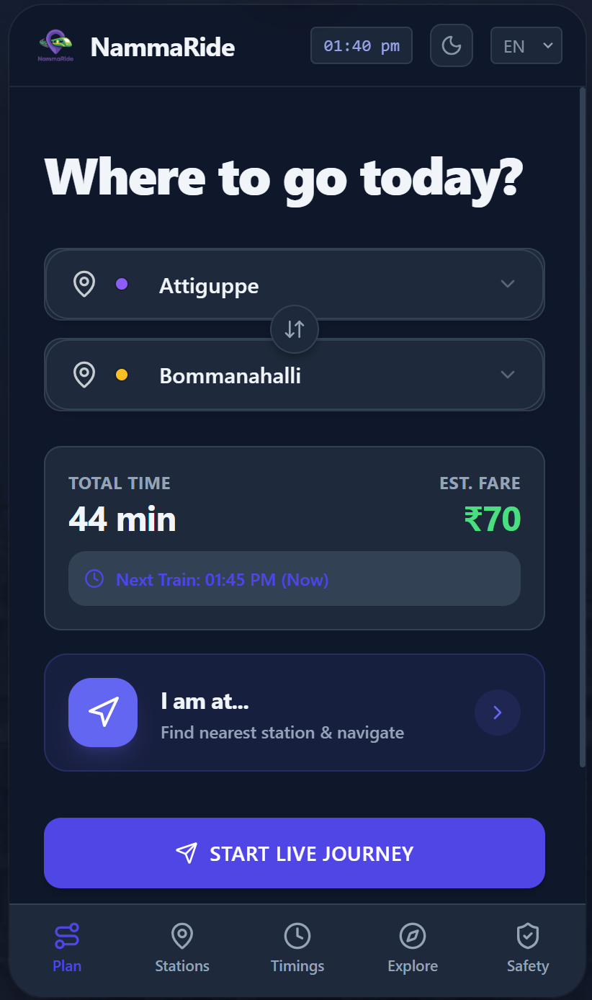
  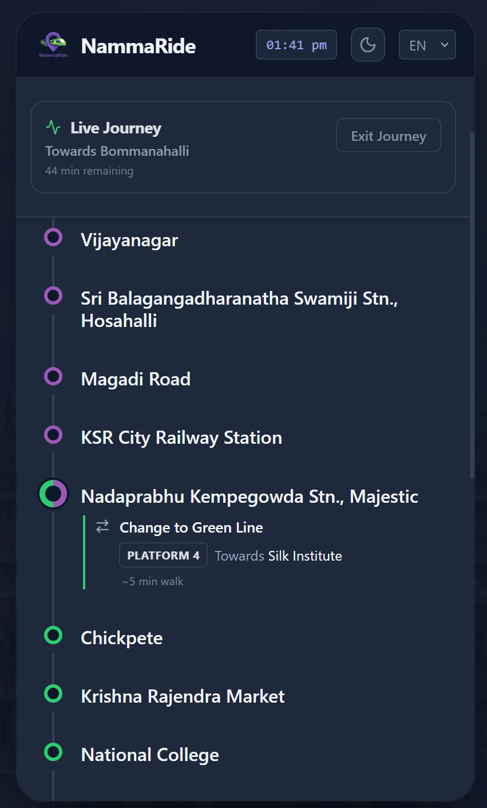
  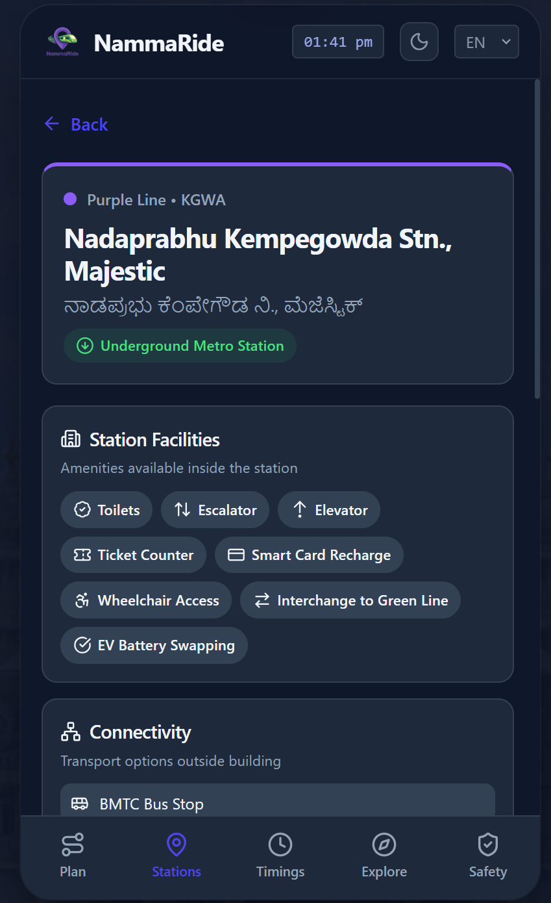
</p>
<p align="center">
  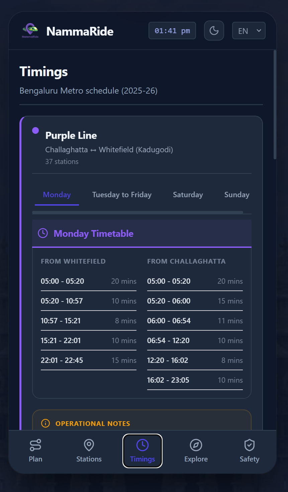
  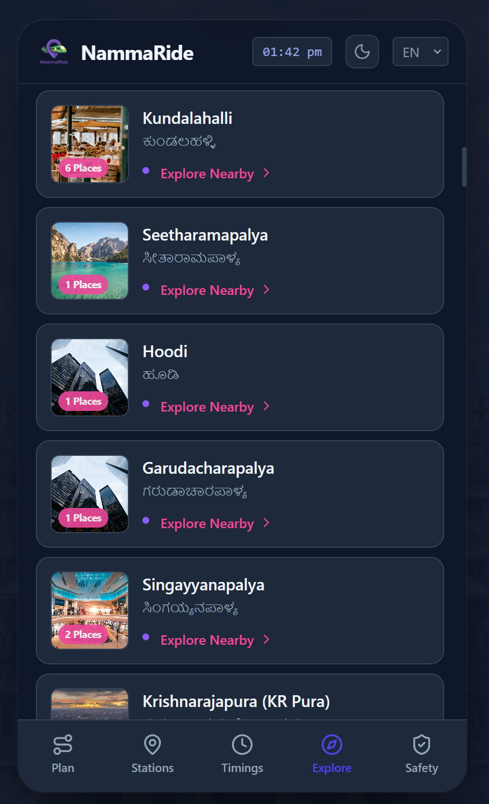
  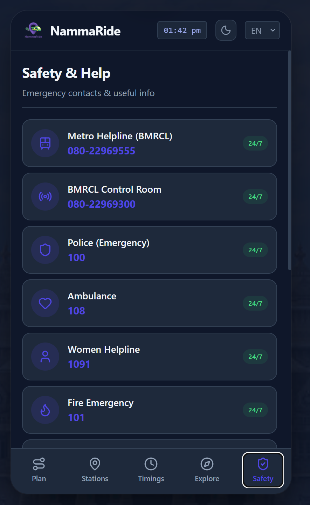
</p>
<p align="center">
  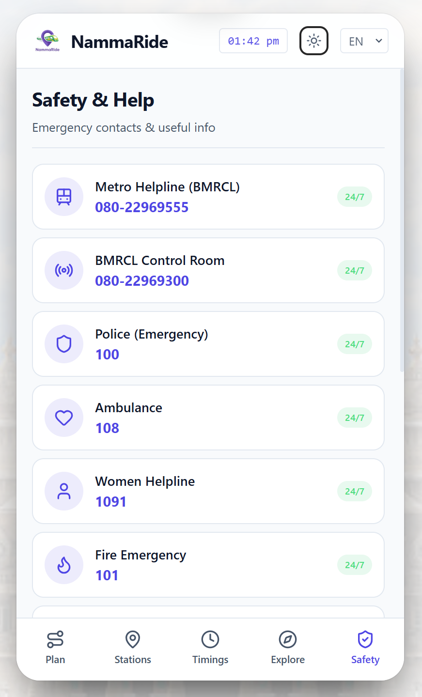
  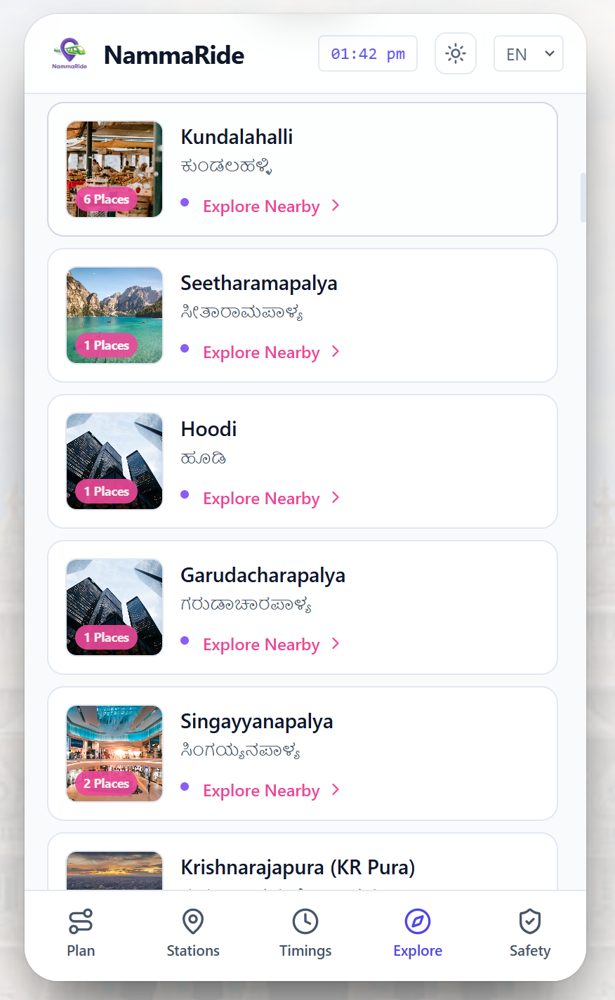
  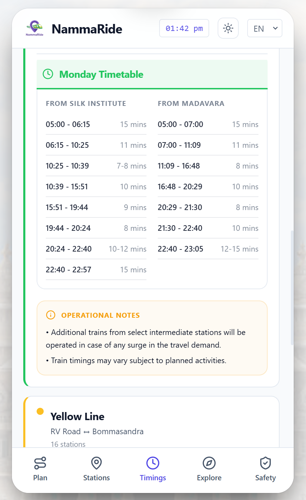
</p>

<details>
<summary>View More Screenshots</summary>
<p align="center">
  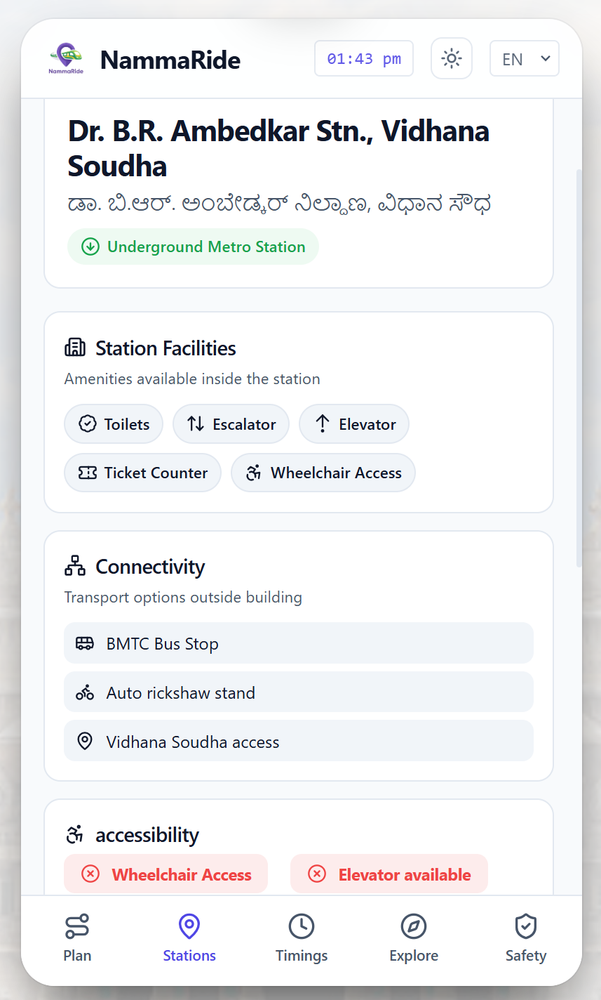
  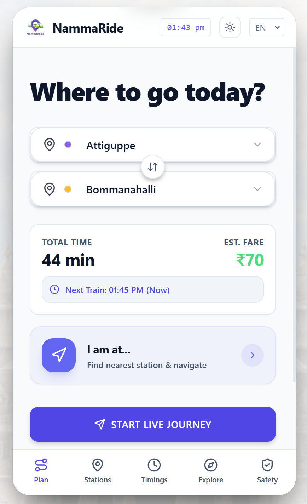
  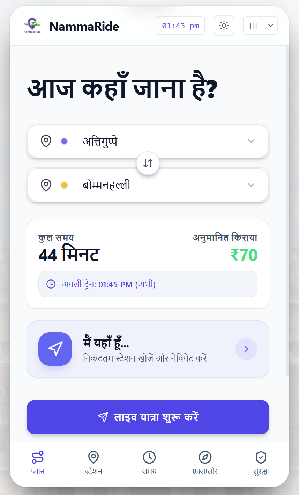
  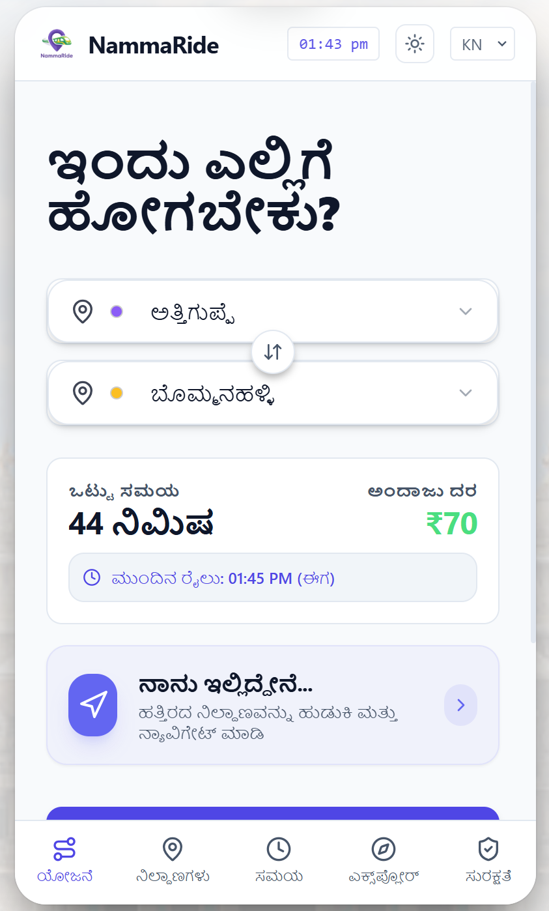
  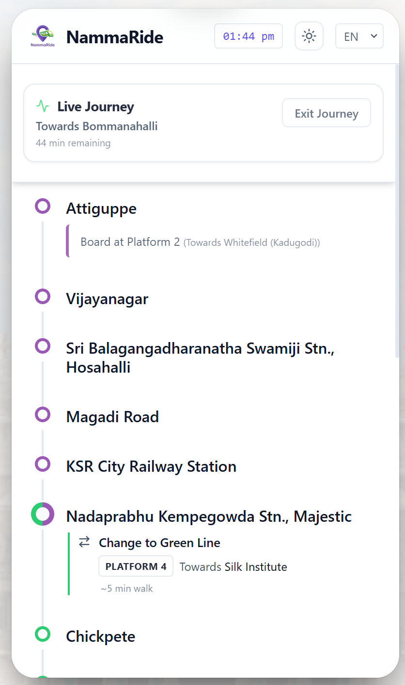
</p>
</details>

---

## ✨ Features

| Feature | Description |
|---|---|
| 🗺️ **Journey Planner** | Plan multi-line routes with accurate fare estimates and interchange guidance |
| 🚉 **Live Journey Simulation** | Track your progress station-by-station with real-time ETA countdowns |
| 🔄 **Smart Interchange** | Platform-level directions for transitions at interchange stations (e.g. Majestic) |
| 📍 **Nearest Station Finder** | GPS-based detection of the closest station with one-tap navigation |
| 🏛️ **Explore Nearby** | Discover 230+ landmarks, hospitals, and parks with real photos |
| 🕒 **Train Timings** | Complete first/last train schedules for all lines and directions |
| 🌍 **Trilingual Support** | Fully localized in **English**, **Kannada (ಕನ್ನಡ)**, and **Hindi (हिन्दी)** |
| 📱 **Native-Like Experience** | Optimized PWA shell with smooth animations and dark-mode by default |

---

## 🛠️ Tech Stack

- **Frontend**: Vanilla ES6+ JavaScript, HTML5, Tailwind CSS
- **App Wrapper**: TWA (Trusted Web Activity) for Play Store deployment
- **Data**: Hand-curated JSON datasets for Namma Metro network
- **SEO**: JSON-LD Structured Data, Open Graph, and Twitter Cards

---

## 🚀 Getting Started

```bash
# Clone the repository
git clone https://github.com/Tusharjain-19/NammaRide.git

# Navigate to the project
cd NammaRide

# Open index.html or run with a local server
python -m http.server 8000
```

---

## 👨‍💻 Developed By

**Tushar Jain**  
[🌐 Website](https://www.tusharjain.in/) · [LinkedIn](https://www.linkedin.com/in/tushar-jain-781149322/) · [GitHub](https://github.com/Tusharjain-19)

---

## 📄 License

MIT © 2025 NammaRide

---

<p align="center">
  <sub>Built with ❤️ for Bengaluru</sub>
</p>
