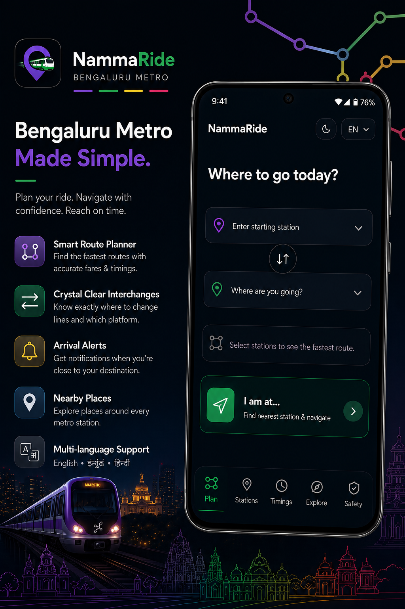
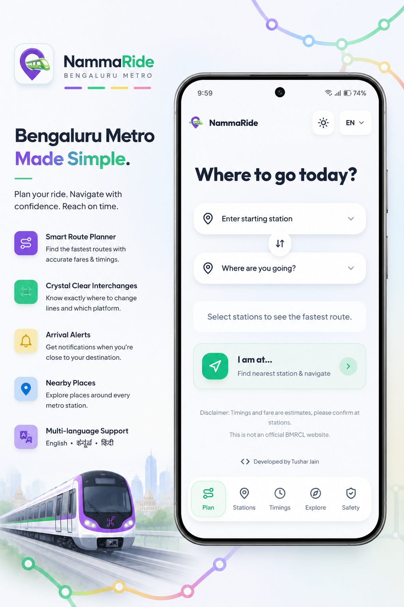
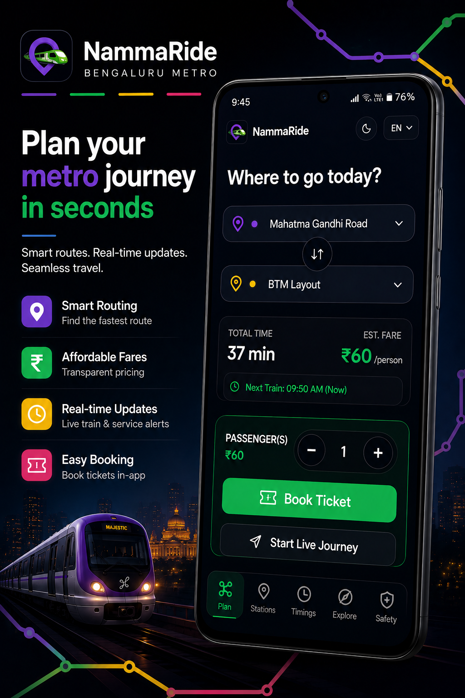
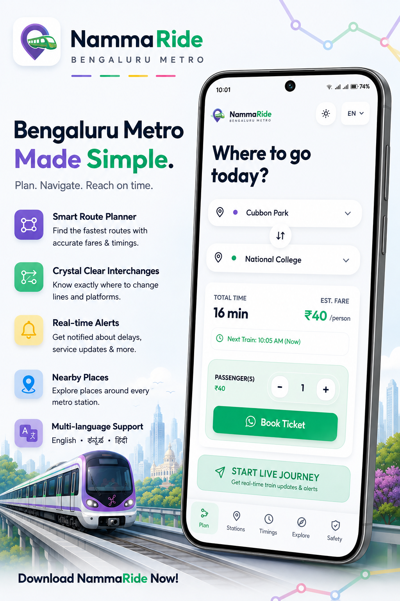
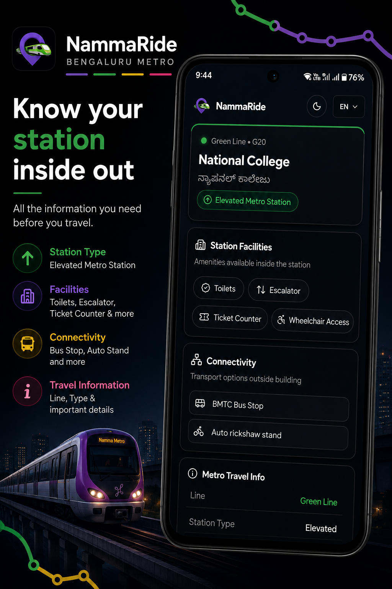
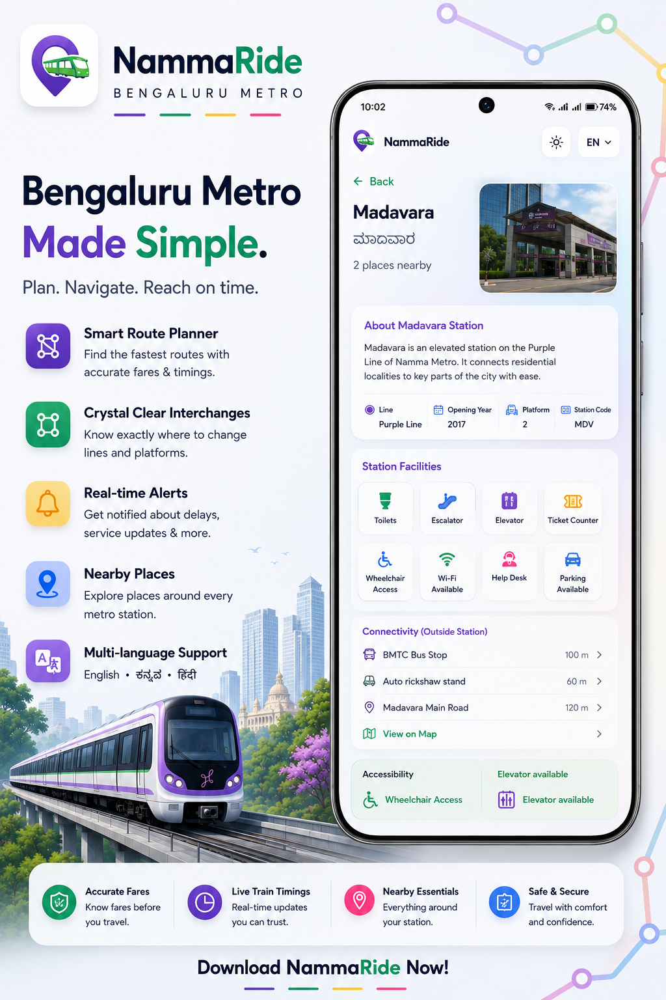
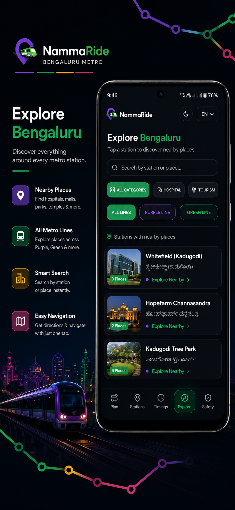
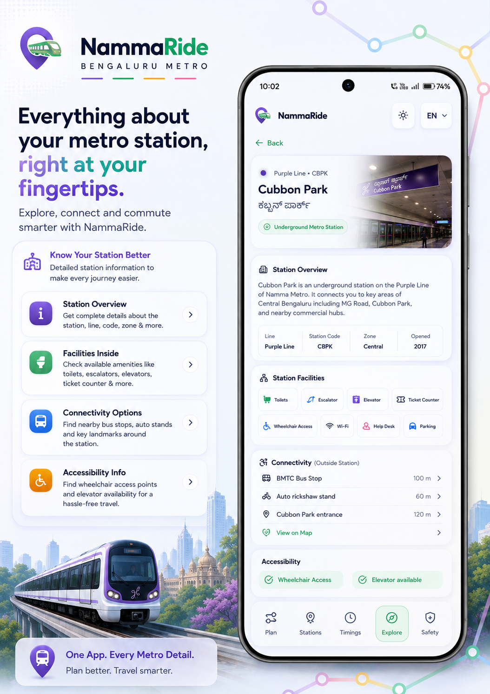
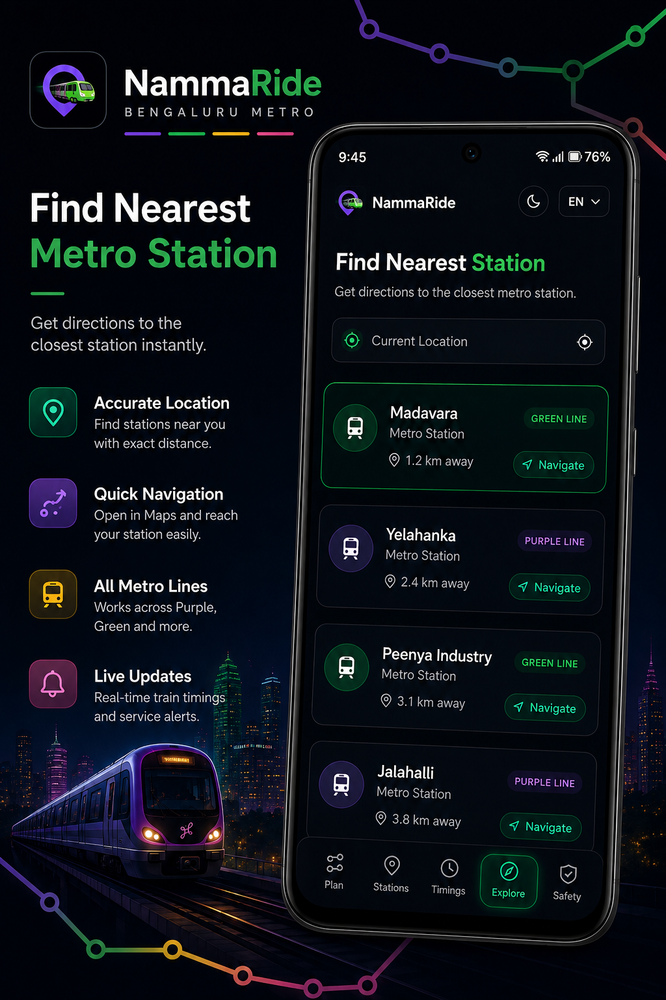
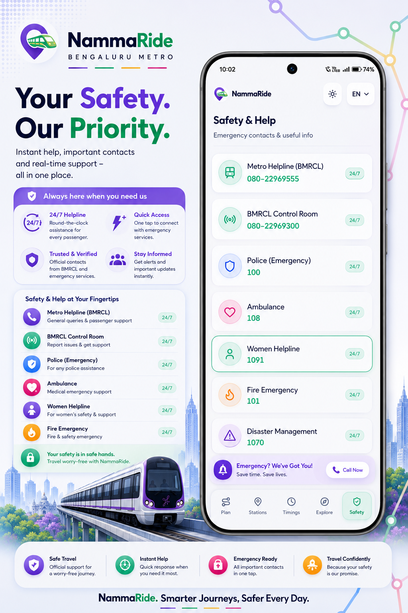

<p align="center">
  
</p>

<h1 align="center">NammaRide</h1>

<p align="center">
  <strong>The Ultimate Companion for Bengaluru's Namma Metro Commuters 🚇</strong>
</p>

<p align="center">
  <a href="https://www.nammaride.site/"></a>
  <a href="https://github.com/Tusharjain-19/NammaRide"></a>
  
</p>

<p align="center">
  
  
  
  
  
</p>

---

## 📖 About NammaRide

**NammaRide** is a high-performance, offline-first web & Capacitor mobile application engineered to simplify commuting on Bengaluru's Namma Metro. 

Unlike generic navigation tools that lose signal underground, NammaRide provides deterministic multi-line journey planning, fare calculations, and live tracking that works 100% offline — deep underground inside metro tunnels.

---

## ✨ Key Features

- 🗺️ **Intelligent Journey Planner**: Multi-line routing with seamless interchange support at Majestic (Purple ↔ Green) and RV Road (Green ↔ Yellow).
- 🎓 **Institutional Landmark Guide**: Includes details, maps navigation, walking distance, and images for colleges including **BMS College of Engineering (BMSCE)** at National College, **Central College**, **National College**, **IISc**, **RVCE**, **PES University**, and **Christ University**.
- 📸 **160+ Watermark-Free Local Place Photos**: Offline high-resolution photography for landmarks, malls, heritage sites, lakes, and tech parks.
- 🕒 **Offline Journey Tracking & Tactile Vibration**: Real-time journey simulation with 3-second tactile vibration feedback upon arrival at your destination station.
- 💰 **Fare Calculator**: Cost estimates for Tokens, Smart Cards, and QR Tickets with official BMRCL discounts.
- 📍 **GPS Nearest Station Finder**: Locate and navigate to the nearest metro station in real time.
- 🌍 **Trilingual Experience**: Native support for **English**, **Kannada (ಕನ್ನಡ)**, and **Hindi (हिन्दी)**.
- 📱 **Adaptive 120Hz Scrolling**: Hardware GPU accelerated, smooth high-refresh-rate user interface.

---

## 📱 Application Screenshots

### 🌙 Dark Mode & ☀️ Light Mode

<p align="center">
  <strong>Trip Planner & Route Summary</strong><br/>
  
  
</p>

<br/>

<p align="center">
  <strong>Live Journey Tracking & Map View</strong><br/>
  
  
</p>

<br/>

<p align="center">
  <strong>Station Directory & Details</strong><br/>
  
  
</p>

<br/>

<p align="center">
  <strong>Train Timings & Schedules</strong><br/>
  
  
</p>

<br/>

<p align="center">
  <strong>Explore Nearby Places & Tourist Attractions</strong><br/>
  
  
</p>

---

## 🚫 License & Strict Non-Commercial Terms

### 🔒 STRICTLY NOT FOR COMMERCIAL USE
This repository and project are licensed under the **Creative Commons Attribution-NonCommercial 4.0 International (CC BY-NC 4.0)** license.

- **Non-Commercial Exclusivity**: You **MAY NOT** sell, rent, monetize, or package this application, its source code, assets, datasets, or mobile builds for commercial purposes.
- **App Store / Play Store Restrictions**: Redistribution or uploading of derived apps to commercial marketplaces (Google Play Store, Apple App Store) for financial gain is strictly prohibited.
- **Educational & Personal Use**: You are free to fork, adapt, and study this project for personal learning, academic research, or community open-source contributions.

*Read the full details in the [LICENSE](LICENSE) file.*

---

## 🛑 BMRCL Disclaimer

**NammaRide** is an independent community project developed by Tushar Jain and is **NOT affiliated with, endorsed by, or connected to BMRCL (Bengaluru Metro Rail Corporation Limited)**. Timings, routes, and fares are generated based on public heuristics and estimates.

---

## 🛠️ Tech Stack & Architecture

```text
NammaRide/
├── website/              # Production Web Application (HTML5, Vanilla ES6 JS, Custom CSS)
│   ├── assets/           # 160+ Local Watermark-Free Place Images & App Icons
│   ├── css/              # Modular Glassmorphism & 120Hz Accelerated CSS
│   └── js/               # Offline Routing Engine, Fares, & Station Places
│
└── mobile/               # Isolated Capacitor 6 Android Application
    ├── android/          # Native Android Gradle Project & Manifest
    └── scripts/          # Offline Asset Sync Tooling
```

---

## 🚀 Local Development Setup

```bash
# Clone the repository
git clone https://github.com/Tusharjain-19/NammaRide.git

# Navigate to the website directory
cd NammaRide/website

# Serve locally (No build step required!)
python -m http.server 3000
```

---

## 👨‍💻 Developer

**Tushar Jain**  
[🌐 Website](https://www.tusharjain.in/) · [LinkedIn](https://www.linkedin.com/in/tushar-jain-781149322/) · [GitHub](https://github.com/Tusharjain-19)

---

<p align="center">
  <sub>Built with ❤️ for Bengaluru • Strictly Non-Commercial</sub>
</p>
