<p align="center">
  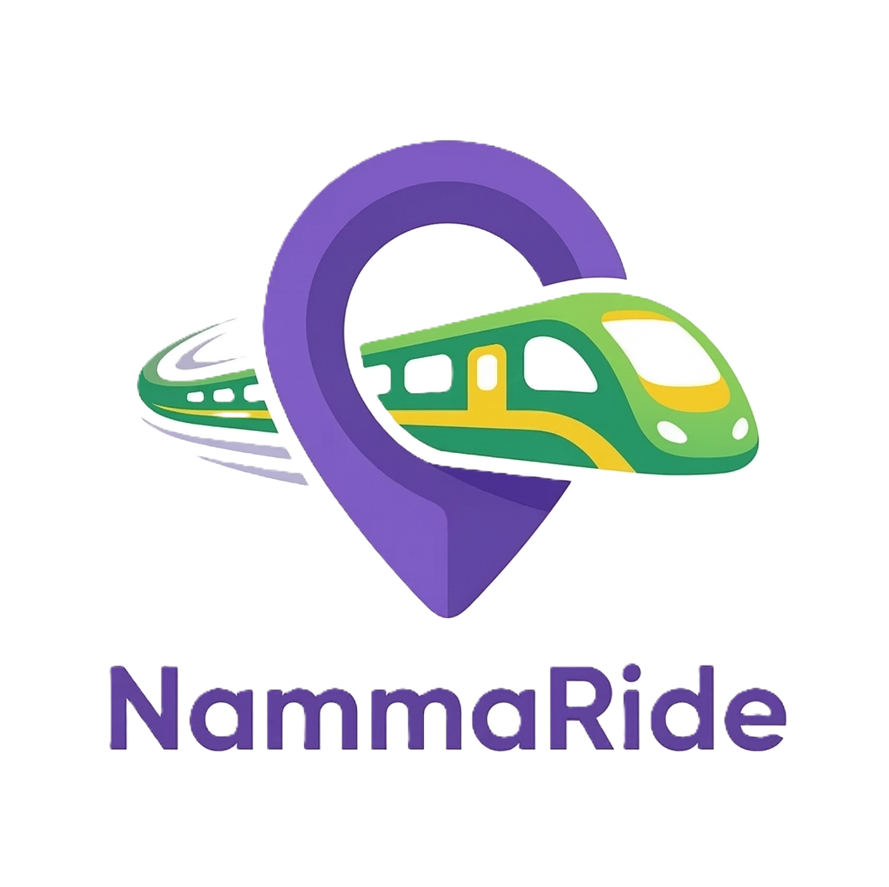
</p>

<h1 align="center">NammaRide</h1>

<p align="center">
  <strong>The Ultimate Companion for Bengaluru's Namma Metro Commuters 🚇</strong>
</p>

<p align="center">
  <a href="https://www.nammaride.site/"></a>
  <a href="https://github.com/Tusharjain-19/NammaRide"></a>
</p>

<p align="center">
  
  
  
  
</p>

---

## 📖 About NammaRide

**NammaRide** is a high-performance, offline-first web application engineered to simplify commuting on Bengaluru's Namma Metro. Unlike generic navigation tools that lose signal underground, NammaRide provides deterministic journey planning and live tracking that works seamlessly even when you are deep underground without network coverage.

Built with an obsessive focus on speed, accessibility, and utility, NammaRide serves as a one-stop digital assistant for fare calculations, train timings, interactive mapping, and discovering the city through the metro network. 

---

## 🖼️ App Gallery

<p align="center">
  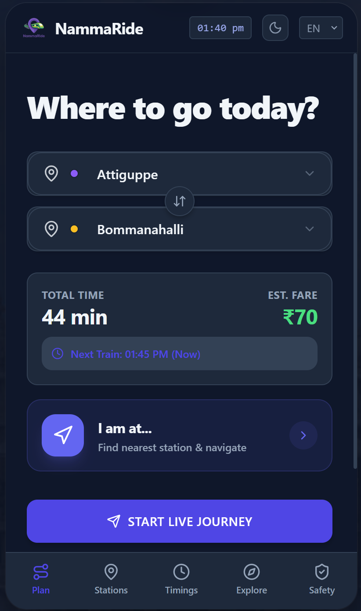
  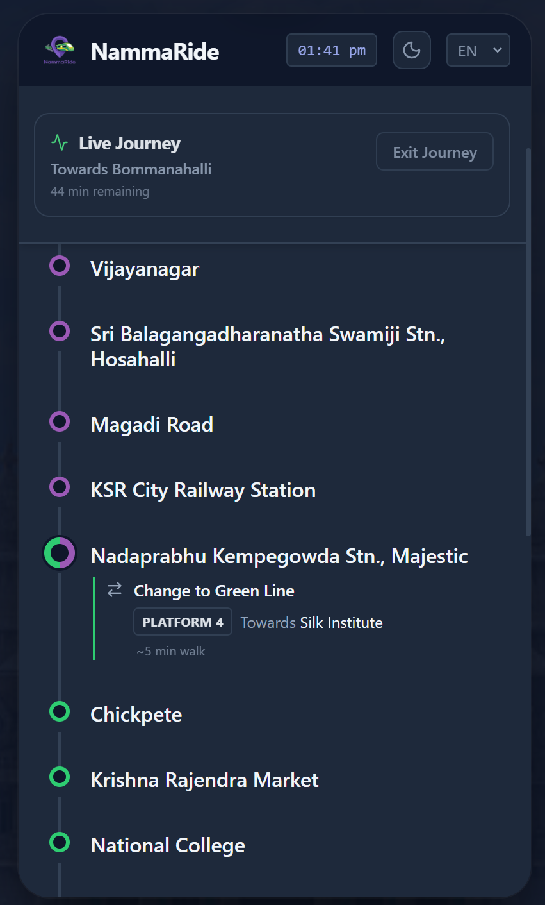
  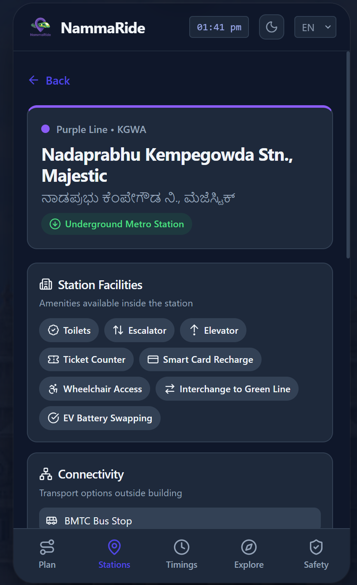
</p>
<p align="center">
  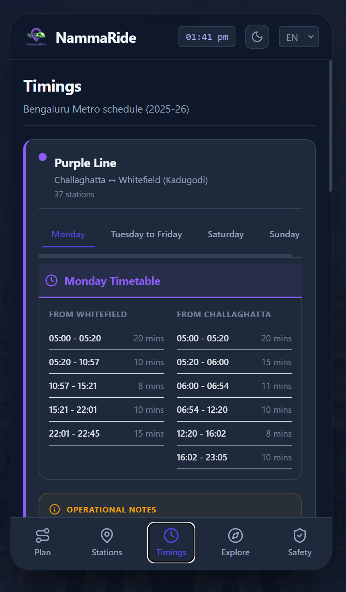
  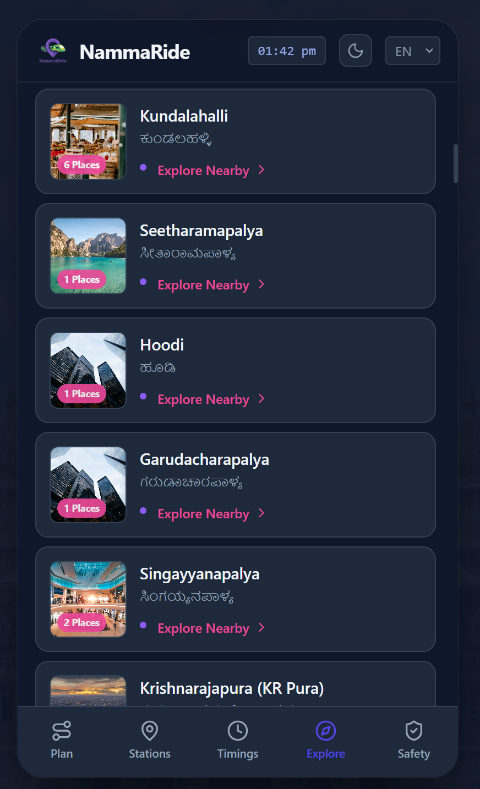
  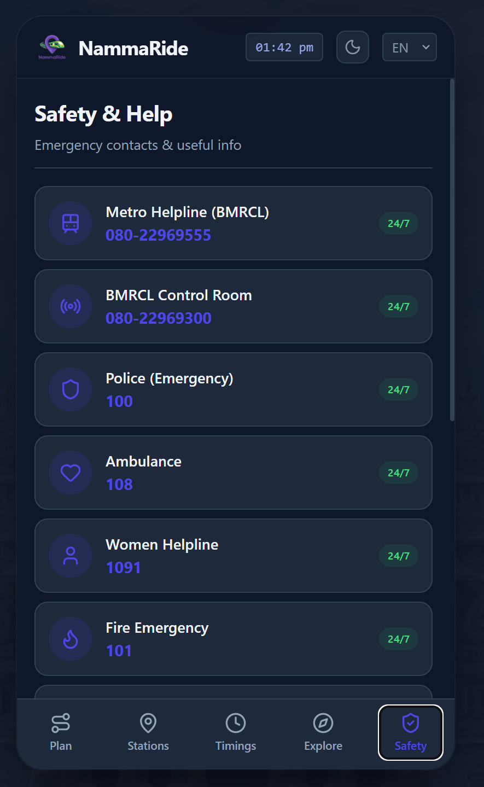
</p>

<details>
<summary><b>📸 See More Screenshots</b></summary>
<br>
<p align="center">
  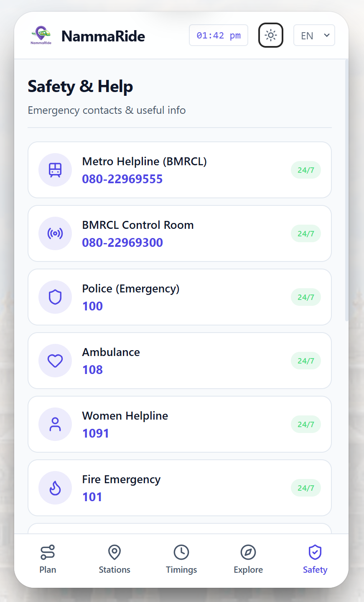
  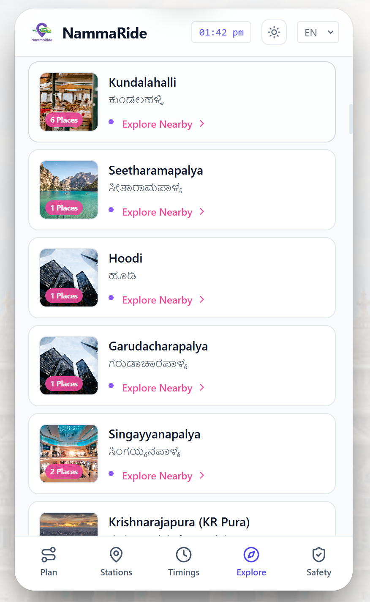
  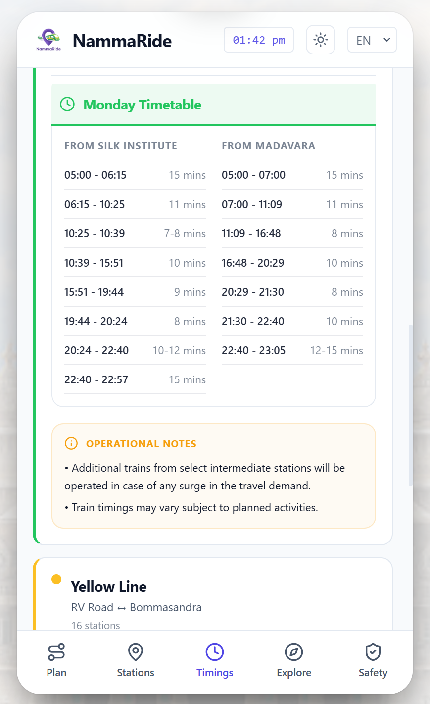
  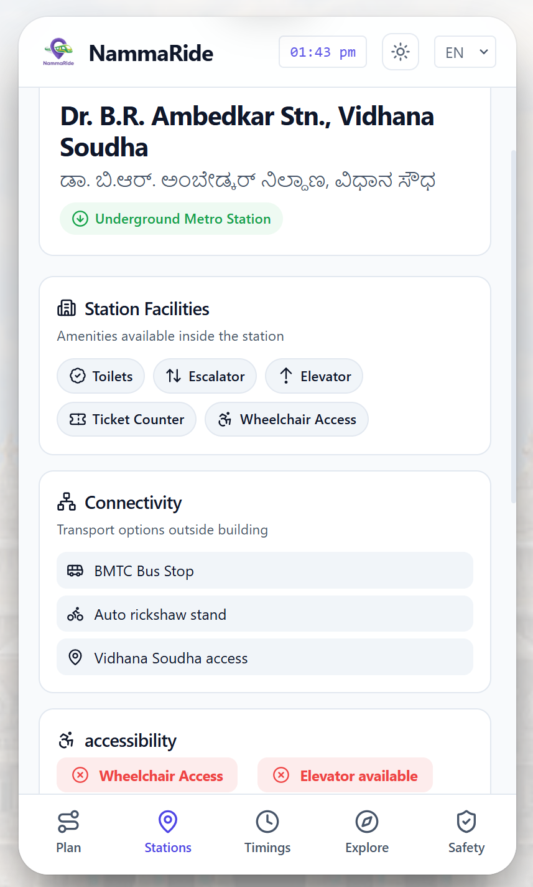
</p>
</details>

---

## ✨ Key Features

- 🗺️ **Intelligent Journey Planner**: Multi-line routing with interchange assistance at Majestic & RV Road.
- 🕒 **Live Journey Tracking**: Time-based simulation to track your progress between stations, 100% offline.
- 💰 **Fare Calculator**: Instant cost estimates for Token, Smart Card, and QR Ticket users.
- 📍 **Smart Locate**: Find and navigate to the absolute nearest metro station using real-time GPS.
- 🏛️ **City Explorer**: Discover 230+ landmarks including Vidhana Soudha, IT parks, malls, and lakes.
- 🌍 **Trilingual Support**: Seamless experience tailored in **English**, **Kannada (ಕನ್ನಡ)**, and **Hindi (ಹಿन्दी)**.
- 📱 **PWA Optimized**: Installable directly to your home screen for a lightning-fast, native-app feel.

---

## ⚠️ Disclaimer & Terms of Use

### 🛑 Non-Official Application
This application is **NOT affiliated with, endorsed by, or connected to BMRCL (Bengaluru Metro Rail Corporation Limited)**. All data including timings and fares are based on public information and heuristics; they should be treated as **estimates only**.

### 💼 No Commercial Use
**Commercial use of this project, its source code, or its datasets is strictly prohibited.**
- You may use this project for **educational purposes** or **personal use** only.
- You are not permitted to sell, rent, or bundle this application with any paid service.

### 🛡️ Safety & Reliability
- Always refer to official BMRCL displays and announcements for safety protocols and real-time train updates.
- Under no circumstances should this application be relied upon for emergency navigation.

---

## 🛠️ Performance & Tech Stack

- **Core**: Vanilla ES6 JavaScript (Zero heavy frameworks for maximum performance and instant load).
- **Styling**: Custom CSS design system featuring true dark mode, glassmorphism, and smooth transitions.
- **Offline Reliability**: Robust Service Worker caching for seamless performance in metro tunnels.
- **TWA Ready**: Designed as a Progressive Web App (PWA), perfectly packaged for Play Store deployment.

---

## 🚀 Quick Start (Local Setup)

```bash
# Clone the repository
git clone https://github.com/Tusharjain-19/NammaRide.git

# Navigate to the project directory
cd NammaRide

# Run the app locally (No build step required!)
# Using Python:
python -m http.server 3000

# Or using Node:
npx serve .
```

---

## 👨‍💻 Developer

**Tushar Jain**  
[🌐 Website](https://www.tusharjain.in/) · [LinkedIn](https://www.linkedin.com/in/tushar-jain-781149322/) · [GitHub](https://github.com/Tusharjain-19)

---

## 📄 License

This project is open-sourced under the MIT License for **personal and academic use**. Commercial redistribution is strictly forbidden.

MIT © 2026 NammaRide

---

<p align="center">
  <sub>Managed with pride by the community build series. Built with ❤️ for Bengaluru.</sub>
</p>
